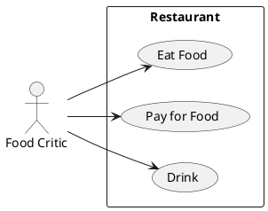

# Описание требований и архитектуры

## Введение

<!-- Общее краткое описание создаваемой системы -->

В рамках курса осуществляется проектирование решения на основе [постановки задачи от &#34;заказчика&#34;](../../task.md).

- [Описание требований и архитектуры](#описание-требований-и-архитектуры)
  - [Введение](#введение)
  - [Заинтересованные стороны](#заинтересованные-стороны)
  - [Бизнес-контекст (бизнес-требования)](#бизнес-контекст-бизнес-требования)
  - [Глоссарий (бизнес-сущности)](#глоссарий-бизнес-сущности)
  - [Модель предметной области](#модель-предметной-области)
  - [Требования к системе](#требования-к-системе)
    - [Функциональные требования](#функциональные-требования)
    - [Нефункциональные требования/Требования к атрибутам качества](#нефункциональные-требованиятребования-к-атрибутам-качества)
    - [Сценарии использования (Use case)](#сценарии-использования-use-case)
      - [Диаграмма сценариев использования (Use Case Diagram) `<!-- omit in toc -->`](#диаграмма-сценариев-использования-use-case-diagram----omit-in-toc---)
      - [Список сценариев использования `<!-- omit in toc -->`](#список-сценариев-использования----omit-in-toc---)
    - [Ограничения](#ограничения)
  - [Архитектура](#архитектура)
    - [Журнал архитектурных решений](#журнал-архитектурных-решений)
    - [Контекст решения](#контекст-решения)
    - [Компонентная архитектура](#компонентная-архитектура)
    - [Реализация сценариев использования](#реализация-сценариев-использования)
    - [Программные интерфейсы](#программные-интерфейсы)
    - [Схема развертывания](#схема-развертывания)

## Заинтересованные стороны

<!-- Перечень заинтересованных сторон и их интересов по отношению к создаваемой системе. 
Подробнее: https://confluence.mts.ru/pages/viewpage.action?pageId=399975538 
-->

| Заинтересованная сторона | Интересы                                                                                                                                                                                                                                                                                                                           |
| :---------------------------------------------- | :----------------------------------------------------------------------------------------------------------------------------------------------------------------------------------------------------------------------------------------------------------------------------------------------------------------------------------------- |
| ПАО МТС                                   | - Распространение информации о компании - Закрепление позиций на рынке - Информирование рынка о собственных направлениях разработки - Привлечение партнеров и специалистов |
| Акционеры ПАО МТС                | - Увеличение доли рынка - Повышение имиджа компании - Увеличение прибыли                                                                                                                                                                                              |
| Докладчики                            | - Привлечение внимания к своей деятельности/личности - Поиск деловых контактов - Получение обратной связи о своей деятельности                                                                                         |
| Модераторы контента           | - Повышение охвата аудитории - Управление взаимоотношениями с докладчиками и слушателями                                                                                                                                                                  |
| Рекламные партнеры             | - Размещение информации о собственных продуктах/проектах - Повышение имиджа собственного бренда                                                                                                                                                     |
| Слушатели докладов             | - Получение информации об актуальных трендах в области IT                                                                                                                                                                                                                                   |
| Разработчики платформы     | - Получение компетенций и опыта в актуальных IT технологиях - Получение вознаграждения                                                                                                                                                                        |
| Инженеры тех. поддержки    | - Обеспечение работоспособности системы - Получение вознаграждения                                                                                                                                                                                                          |

## Бизнес-контекст (бизнес-требования)

<!-- Общее описание бизнес-контекста создаваемой системы (автоматизируемой деятельности), список бизнес-целей заинтересованных сторон 
Подробнее: https://confluence.mts.ru/pages/viewpage.action?pageId=399973845
-->

| ID         | Бизнес-требование                                                                                                                                                                                                                                                                                                                                                                                                         |
| ---------- | ----------------------------------------------------------------------------------------------------------------------------------------------------------------------------------------------------------------------------------------------------------------------------------------------------------------------------------------------------------------------------------------------------------------------------------------- |
| BR-CONF-01 | Система должна предоставлять возможность планировать конференции во времени и уведомлять заинересованные стороны о важных событиях.                                                                                                                                                                             |
| BR-CONF-02 | Система должна обеспечивать непрерывный доступ к онлайн-трансляциям и к записям конференций.                                                                                                                                                                                                                                                             |
| BR-CONF-03 | Система должна предоставлять возможности по взаимодействию с участниками и наблюдателями конференций.                                                                                                                                                                                                                                           |
| BR-CONF-04 | Участники конференций должны мочь участвовать как очно, так и дистанционно.                                                                                                                                                                                                                                                                                               |
| BR-CONF-05 | Для адресного информирования неопределенного круга потенциальных экосистемных партнеров необходимо представлять информацию о новейших интерфейсах взаимодействия с системами МТС например через доклады на on-line конференции. |
| BR-CONF-06 | Для поиска, проверки перспективности и дальнейшего выкупа интересных стартапов необходимо выстраивать коммуникации с ними посредством проведения on-line конференций.                                                                                                                   |

## Глоссарий (бизнес-сущности)

<!-- Содержит основные понятия и термины предметной области  
Подробнее: https://confluence.mts.ru/pages/viewpage.action?pageId=375782595
-->

| Понятие              | Сокращение | Определение                                                                                                                                                                                                                                             |
| :-------------------------- | :------------------- | :----------------------------------------------------------------------------------------------------------------------------------------------------------------------------------------------------------------------------------------------------------------- |
| Пользователь    |                      | Человек, который взаимодействует с системой.                                                                                                                                                                                 |
| Роль                    |                      | Атрибут пользователя, который наделяет его теми или иными возможностями в системе.                                                                                                           |
| Личный кабинет | ЛК                 | Часть системы, в которой в зависимости от роли пользователя после авторизации есть возможность выполнять те или иные действия.                    |
| Календарь          |                      | Часть системы, позволяющая пользователю управлять конференциями, к которым он имеет отношение.                                                                               |
| Конференция      |                      | Событие с определенной датой и временем, состоящее из нескольких выступлений докладчиков, следующих друг за другом, транслирующееся on-line. |

## [Модель предметной области](data/data.md)

## Требования к системе

### Функциональные требования

<!-- Описание требований к функциям, реализуемым системой. Требование может быть привязано к сценарию использования или быть общим 
Подробнее: https://confluence.mts.ru/pages/viewpage.action?pageId=375782501 
-->

| ID     | Функциональное требование                                                                                                  |
| ------ | -------------------------------------------------------------------------------------------------------------------------------------------------- |
| FR.001 | Слушателю просматривать список конференций                                                                  |
| FR.002 | Слушателю получать уведомления о конференциях                                                             |
| FR.003 | Докладчику подать материалы о своем докладе                                                                  |
| FR.004 | Докладчику во время конференции демонстрировать материалы на своем устройстве |
| FR.005 | Модератору просматривать присланный докладчиками контент                                       |
| FR.006 | Модератру коммуницировать с докладчиком                                                                        |
| FR.007 | Модератору планировать расписание и наполнение конференций                                    |
| FR.008 | Модератору                                                                                                                               |

### Бизнес-метрики

| Бизнес-метрика                                                                  | Нефункциональное требование |
| -------------------------------------------------------------------------------------------- | ----------------------------------------------------- |
| Число одновременно подключенных пользователей |                                                       |
| Доступность информации о конференции                        |                                                       |
|                                                                                              |                                                       |

### Нефункциональные требования/Требования к атрибутам качества

<!-- Требования к основным архитектурным характеристикам (атрибутам качества) системы - надежность, масштабируемость, ИБ, и др.
Подробнее: https://confluence.mts.ru/pages/viewpage.action?pageId=375782530
-->

| ID     | Атрибут качества                            | Описание требования                                                                                                                                                      |
| ------ | ---------------------------------------------------------- | ------------------------------------------------------------------------------------------------------------------------------------------------------------------------------------------ |
| QR.001 | Пропускная способность                | Система должна выдерживать не менее 10,000 одновременных подключений к одной конференции.                     |
| QR.002 | Задержка передачи контента         | Допустимая задержка эфира от реального времени во время конференции должна быть не более 1 секудны |
| QR.003 | Доступность                                     | Система должна быть доступна для выполнения всех заявленных функций 99.99% времени                                  |
| QR.004 | Длительность хранения контента | Контент конференции должен быть доступен на протяжении 5 лет после её завершения                                  |
| QR.005 | Время отклика                                  | Время загрузки информации о конференции в web-форме не превышает 1 секунды                                                 |

### Сценарии использования (Use case)

<!-- Подробное описание сценариев использования системы с привязкой к ролям участников и задействованным бизнес-сущностям 
https://confluence.mts.ru/pages/viewpage.action?pageId=375782108 
https://confluence.mts.ru/pages/viewpage.action?pageId=375782119 
-->

#### Диаграмма сценариев использования (Use Case Diagram) `<!-- omit in toc -->`

#### Список сценариев использования `<!-- omit in toc -->`

| ID     | Описание                                                              |
| ------ | ----------------------------------------------------------------------------- |
| UC.001 | *[Название сценария использования](uc/uc.001.md)* |

### Ограничения

<!-- Описываются ограничения, оказывающие влияние на архитектуру системы - временные, финансовые, технологические
Подробнее: https://confluence.mts.ru/pages/viewpage.action?pageId=375782592
-->

| ID     | Ограничение                      |
| ------ | ------------------------------------------- |
| AC.001 | *Описание ограничения* |

## Архитектура

### Журнал архитектурных решений

<!-- Записи о ключевых принятых архитектурных решениях (ADR) для реализации архитектурно-значимых требований.
Подробнее: https://confluence.mts.ru/pages/viewpage.action?pageId=421162308
-->

- [ADR.NNN Суть решения](adr/adr-template.md)

### [Контекст решения](context/context.md)

### [Компонентная архитектура](components/components.md)

### Реализация сценариев использования

<!-- Реализация сценариев использования на основе взаимодействия компонентов системы и внешних систем/участников.
Диаграммы последовательности (UML Sequence diagram) и текстовое описание.

Подробнее: 
https://confluence.mts.ru/pages/viewpage.action?pageId=399442132
https://confluence.mts.ru/pages/viewpage.action?pageId=399442170
-->

| ID     | Описание                                                 | Реализация                                         |
| ------ | ---------------------------------------------------------------- | ------------------------------------------------------------ |
| UC.001 | *Название сценария использования* | [Реализация сценария](uc-impl/uc.001-impl.md) |

### Программные интерфейсы

<!-- Спецификации публичных API системы и ее компонентов (синхронных, событийных). Создается на основе модели предметной области для реализации сценариев использования. 
  Форматы: OAS/Swagger, GraphQL, AsyncAPI/CloudEvents
-->

| Компонент                        | Интерфейс                                              |
| :---------------------------------------- | :-------------------------------------------------------------- |
| *Название компонента* | *[Название интерфейса](api/service-name.yaml)* |

### [Схема развертывания](deployment/deployment.md)
